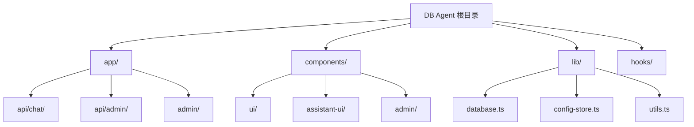

# DB Agent - 项目文档

> 基于 Next.js + assistant-ui 构建的智能数据库查询助手

## 变更记录 (Changelog)

| 时间 | 操作 | 说明 |
|------|------|------|
| 2026-01-28T22:43:26 | 初始化 | 架构师完成首次全仓扫描并生成文档 |

---

## 项目愿景

DB Agent 是一个智能数据库查询助手，允许用户通过自然语言与数据库交互。系统将自然语言转换为 SQL 查询并执行，提供直观的聊天界面和管理后台。

## 架构总览

```
db-agent/
├── app/                    # Next.js App Router 页面
│   ├── api/               # API 路由
│   │   ├── chat/          # 聊天 API (AI 对话)
│   │   └── admin/         # 管理 API (数据库连接测试)
│   ├── admin/             # 管理后台页面
│   └── (root)             # 主聊天界面
├── components/            # React 组件
│   ├── ui/               # 基础 UI 组件 (shadcn/ui)
│   ├── assistant-ui/     # 聊天界面组件
│   └── admin/            # 管理后台组件
├── lib/                   # 工具库与核心逻辑
│   ├── database.ts       # 数据库连接测试
│   ├── config-store.ts   # Zustand 状态管理
│   └── utils.ts          # 工具函数
└── hooks/                 # React Hooks
```

## 模块结构图



## 模块索引

| 模块 | 路径 | 职责 | 入口文件 |
|------|------|------|----------|
| 聊天界面 | `app/` | 主聊天页面与 AI 对话 | `app/page.tsx` |
| 聊天 API | `app/api/chat/` | AI 流式响应端点 | `app/api/chat/route.ts` |
| 管理后台 | `app/admin/` | LLM 和数据库配置管理 | `app/admin/page.tsx` |
| 连接测试 API | `app/api/admin/` | 数据库连接测试 | `app/api/admin/test-connection/route.ts` |
| UI 组件 | `components/ui/` | shadcn/ui 基础组件 | - |
| 聊天组件 | `components/assistant-ui/` | assistant-ui 聊天组件 | `thread.tsx` |
| 管理组件 | `components/admin/` | 管理后台 UI 组件 | `admin-layout.tsx` |
| 核心库 | `lib/` | 数据库、状态管理、工具 | - |

## 运行与开发

### 环境要求

- Node.js 18+
- pnpm 10.28.0 (指定包管理器)

### 安装依赖

```bash
pnpm install
```

### 环境变量配置

复制 `.env.example` 为 `.env.local` 并配置:

```bash
OPENAI_API_KEY=sk-xxxx  # OpenAI API 密钥
```

### 开发命令

```bash
pnpm dev        # 启动开发服务器 (Turbopack)
pnpm build      # 生产构建
pnpm start      # 启动生产服务器
pnpm lint       # 代码检查 (Biome)
pnpm lint:fix   # 自动修复代码问题
```

### 访问地址

- 聊天界面: `http://localhost:3000`
- 管理后台: `http://localhost:3000/admin`
- 数据库管理: `http://localhost:3000/admin/databases`

## 技术栈

### 前端框架

| 技术 | 版本 | 用途 |
|------|------|------|
| Next.js | 16.1.5 | React 全栈框架 |
| React | 19.2.4 | UI 库 |
| TypeScript | 5.9.3 | 类型安全 |
| Tailwind CSS | 4.1.18 | 样式框架 |

### AI 集成

| 技术 | 版本 | 用途 |
|------|------|------|
| ai (Vercel AI SDK) | 6.0.57 | AI 流式响应 |
| @ai-sdk/openai | 3.0.21 | OpenAI 适配器 |
| @ai-sdk/anthropic | 3.0.28 | Anthropic 适配器 |
| @assistant-ui/react | 0.12.1 | 聊天 UI 组件库 |
| @assistant-ui/react-ai-sdk | 1.3.1 | AI SDK 集成 |

### 数据库驱动

| 驱动 | 版本 | 支持数据库 |
|------|------|-----------|
| pg | 8.17.2 | PostgreSQL |
| mysql2 | 3.16.2 | MySQL |
| better-sqlite3 | 12.6.2 | SQLite |
| mssql | 12.2.0 | SQL Server |
| oracledb | 6.10.0 | Oracle |

### 状态管理与动画

| 技术 | 版本 | 用途 |
|------|------|------|
| Zustand | 5.0.10 | 全局状态管理 |
| Framer Motion | 12.29.2 | 动画效果 |

## 测试策略

当前项目**尚未配置测试框架**。建议后续添加:

- 单元测试: Vitest
- 组件测试: React Testing Library
- E2E 测试: Playwright

## 编码规范

### Biome 配置要点

- **缩进**: 2 空格
- **行宽**: 80 字符
- **引号**: 双引号
- **分号**: 必须
- **尾逗号**: 始终添加
- **React/Next.js 规则**: 全部启用

### 路径别名

- `@/*` 映射到项目根目录

### 组件开发规范

- 使用函数组件 + Hooks
- 客户端组件需添加 `"use client"` 指令
- UI 组件使用 shadcn/ui 风格 (Radix + Tailwind)

## AI 使用指引

### assistant-ui 模式

- 使用 `AssistantRuntimeProvider` 包裹应用
- 使用 `useChatRuntime` hook 配置 AI SDK transport
- `Thread` 组件提供完整聊天界面
- 支持 Markdown 渲染、代码高亮、推理展示

### API 路由模式

聊天 API 位于 `app/api/chat/route.ts`:

```typescript
import { openai } from "@ai-sdk/openai";
import { streamText, convertToModelMessages } from "ai";

export async function POST(req: Request) {
  const { messages } = await req.json();
  const result = streamText({
    model: openai.responses("gpt-5-nano"),
    messages: await convertToModelMessages(messages),
  });
  return result.toUIMessageStreamResponse({ sendReasoning: true });
}
```

### 状态管理模式

使用 Zustand 管理 LLM 和数据库配置:

```typescript
import { useConfigStore } from "@/lib/config-store";

const { llmConfigs, addLLMConfig, dbConfigs, addDBConfig } = useConfigStore();
```

**安全提示**: API 密钥和数据库密码不会持久化到 localStorage。

## 关键文件清单

| 文件 | 用途 |
|------|------|
| `app/assistant.tsx` | 主聊天组件，配置 AI Runtime |
| `app/api/chat/route.ts` | AI 聊天 API 端点 |
| `lib/database.ts` | 多数据库连接测试逻辑 |
| `lib/config-store.ts` | Zustand 状态 store |
| `components/admin/admin-layout.tsx` | 管理后台布局 |
| `components/admin/llm-config-panel.tsx` | LLM Provider 配置面板 |
| `components/admin/database-config-panel.tsx` | 数据库配置面板 |
| `components/assistant-ui/thread.tsx` | 聊天线程 UI 组件 |
| `biome.json` | Biome 代码规范配置 |
| `tsconfig.json` | TypeScript 配置 |
| `package.json` | 项目依赖与脚本 |

## 相关资源

- [assistant-ui 文档](https://www.assistant-ui.com/docs/getting-started)
- [Vercel AI SDK 文档](https://sdk.vercel.ai/docs)
- [Next.js 文档](https://nextjs.org/docs)
- [Tailwind CSS 4 文档](https://tailwindcss.com/docs)
- [Zustand 文档](https://docs.pmnd.rs/zustand)
